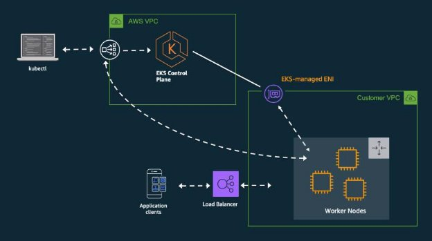

**AMAZON ELASTIC KUBERNETES SERVICE (EKS) NOTES**  

**What is Amazon EKS?** 

- Amazon Elastic Kubernetes Service (EKS) is a managed Kubernetes service provided by AWS. It makes it easy to deploy, manage, and scale containerized applications using Kubernetes. 

**Benefits of Amazon EKS**    

- Scalability: EKS allows you to scale your applications effortlessly as your requirements change. 
- High Availability: It offers a highly available and reliable environment for your applications. 
- Easy Management: AWS manages the control plane, so you can focus on your applications. 

**Architectural Diagram:** 

**Setting up Amazon EKS: **

1) **Create an AWS Account** 
- If you haven't already, sign up for an AWS free tier account. 
2) **Install AWS CLI** 
- Install and configure the AWS Command Line Interface (CLI) on your local.

**COMMANDS:** 

curl "https://awscli.amazonaws.com/awscli-exe-linux-x86\_64.zip" -o "awscliv2.zip" 

sudo apt install unzip 

unzip awscliv2.zip 

sudo ./aws/install -i /usr/local/aws-cli -b /usr/local/bin --update 

3) **Create an IAM Role for EKS** 
- Create an IAM role with the necessary permissions for EKS. 

**STEPS:** 

1. **Create an IAM User:** 
- Go to the AWS IAM console. 
- Create a new IAM user named "eks-admin." 
- Attach the "AdministratorAccess" policy to this user. 
2. **Create Security Credentials:** 
- After creating the user, generate an Access Key and Secret Access Key for this user. 
4) **Launch AWS instance and get access to the instance** 
4) **Configure AWS CLI:** 
4) **Configure the AWS CLI with the Access Key and Secret Access Key from step 2:** 
7) **Kubernetes tools setup:** aws configure 
- **Install kubectl:**

curl -o kubectl https://amazon-eks.s3.us-west-

2\.amazonaws.com/1.19.6/2021-01-05/bin/linux/amd64/kubectl chmod +x ./kubectl 

sudo mv ./kubectl /usr/local/bin 

kubectl version --short –client 

- **Install eksctl:** 

curl --silent --location "https://github.com/weaveworks/eksctl/releases/latest/download/ eksctl\_$(uname -s)\_amd64.tar.gz" | tar xz -C /tmp 

sudo mv /tmp/eksctl /usr/local/bin 

eksctl version 

8) **EKS Cluster Setup:** 
- Use eksctl to create the EKS cluster

**NOTE:** Make sure to replace <cluster-name> and <region> with your desired values 

eksctl create cluster --name <cluster-name> --region <region> --node-type t2.micro --nodes-min 2 --nodes-max 2 

- Update your kubeconfig to connect to the newly created EKS cluster: aws eks update-kubeconfig --region <region> --name <cluster-name> 
9) **Verify Nodes:**

kubectl get nodes 

**Basic to Advanced EKS Commands   **

1. **Get Cluster Information** 

aws eks describe-cluster --name <cluster-name> --region <region> 

2. **List Worker Nodes** 

kubectl get nodes 

3. **Deploy an application** 

kubectl apply -f <yaml-file> 

4. **Scale a Deployment** 

   `       `kubectl scale deployment <deployment-name> --replicas=<number> 

5. **View Pods in a Namespace** 

kubectl get pods -n <namespace> 

6. **Check Cluster Events** 

kubectl get events 

7. **Create a Persistent Volume** 

kubectl apply -f <pv-definition.yaml> 

8. **Apply a Rolling Update** 

kubectl set image deployment/<deployment-name> <container-name>=<new- image> 

9. **Enable Autoscaling** 

kubectl autoscale deployment <deployment-name> --min=3 --max=5 
